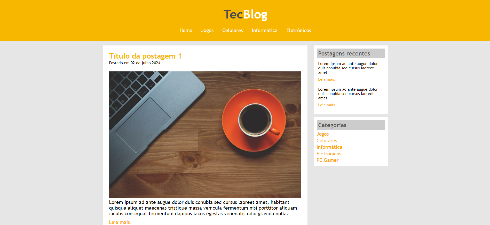
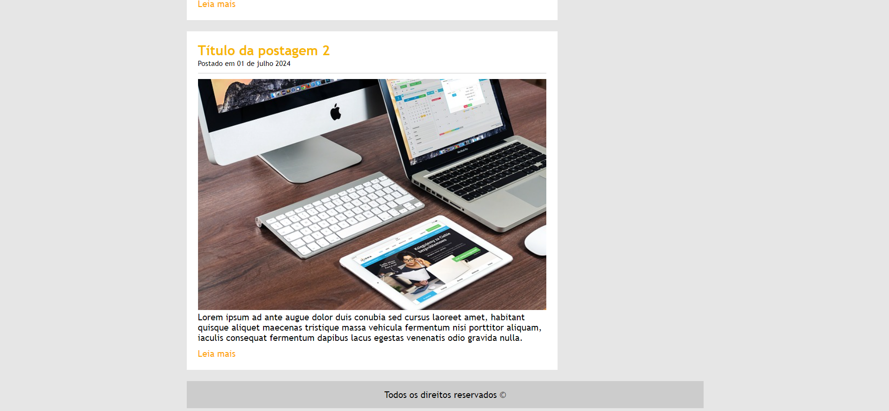

# Projeto TecBlog
Projeto TecBlog - Estudo de HTML5 e CSS3.

## Descrição
O Projeto Projeto TecBlog faz parte do Curso Desenvolvimento Web Completo Ministrado pelo Prof° Jorge Sant'Ana e Prof° Jamilton Damasceno na plataforma Udemy.

## Tecnologias Utilizadas
- *HTML5*: Linguagem de marcação utilizada para o desenvolvimento da página;
- *CSS3*: Linguagem de estilo utilizada para estilizar os componentes do site.

## Topo: 

## Rodapé: 

## Autora
- *Bianca Reis Santana* - Desenvolvimento inicial - [ReisBianca]( https://github.com/ReisBianca)
